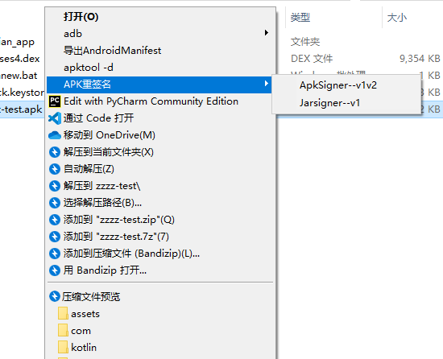
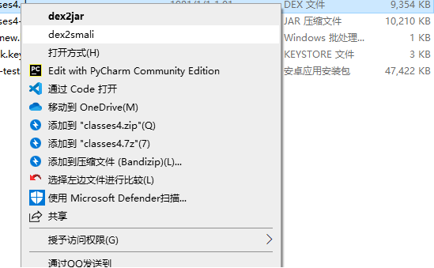
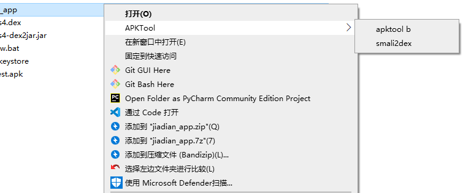
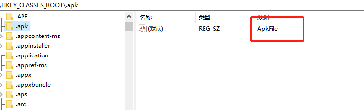
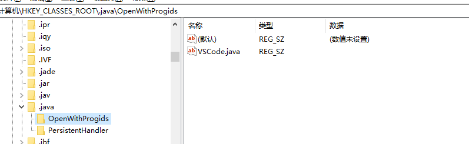
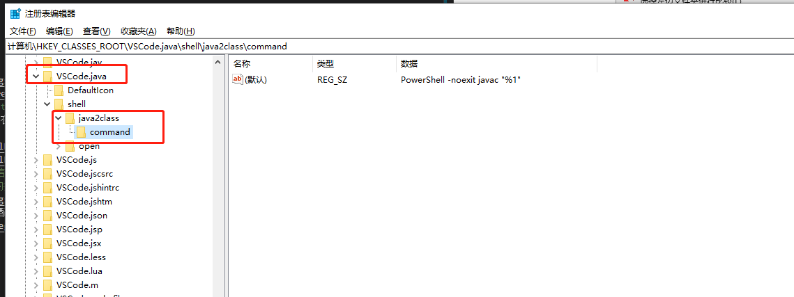

# Apktool-Windows-Registry

配置注册表为 APK 文件增加右键菜单组实现快捷安装与快捷反编译

***

## 效果

- apk

- dex

- folder

---

## 功能

- [adb install -r / -t](./regs/adb.reg)（需要在环境变量中配置adb所在路径）
- [APK 重签名 v1 / v1&v2](./regs/sign.reg)（需要修改 SDK_DIR 和 keystore 信息）
- [导出 apk 的 AndroidManifest.xml](./regs/apkanalyzer.reg)（需要在环境变量中配置`Android_Sdk\tools\bin`目录，在目录下新建脚本[ApkAnalyzer.cmd](./regs/ApkAnalyzer.cmd)，修改`APP_HOME`）
- [apktool -d](./regs/apktoolD.reg)(脚本中写的`apktool.jar`是相对路径，根据需要修改)
- [apktool -b](./regs/apktoolB.reg)(同上)
- [打印 apk 中 rsa 文件的签名信息](./regs/cert.reg)(需要配置 jdk 环境变量)
- [打印 keystore 和 jks 文件的签名信息](./regs/keystore.reg)(同上)
- [dex2jar & dex2smali](./regs/dex.reg)(`d2j`和`baksmali.jar`需要配置)
- [cfr.jar](./regs/cfr.reg)(配置`cfr.jar`)
- [jar2dex](./regs/jar2dex.reg)(配置`dx.jar`)
- [class2dex](./regs/class2dex.reg)(配置`SDK_DIR`)
- [bundletool-aab转apks&apks安装](./regs/bundletool.reg)(配置`DIR`)
---

## 配置

1. 在注册表中找到`HKEY_CLASSES_ROOT`下的`.xxx`，确定拓展名对应的配置

2. 如果没有拓展名，手动创建，然后新建项`.xxx/shell/name/command`或`.xxx/shell/sub/shell/name/command`

3. 部分的类型被其他软件注册，可以看到

    

    或

    

    需要到对应的项下去配置，如

    

4. 参照本机路径和环境、文件位置配置注册表命令

---

# Todo
使用 GUI 实现全部功能